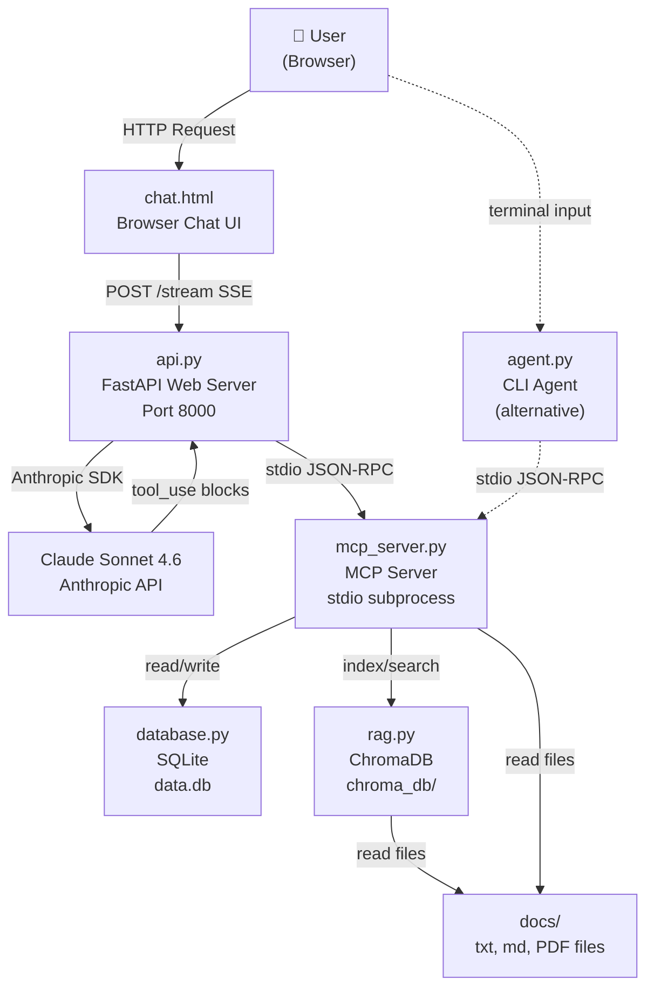
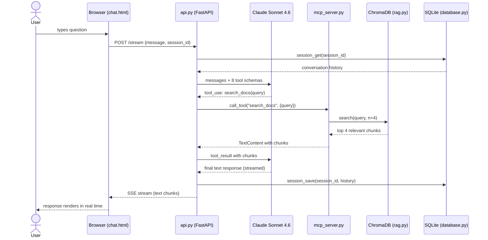
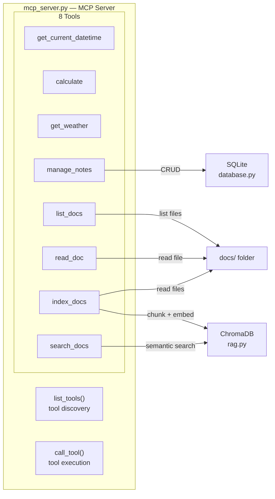
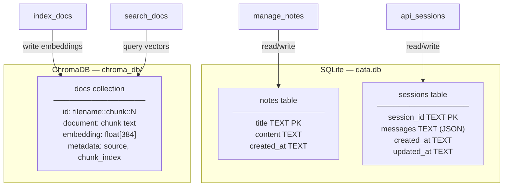
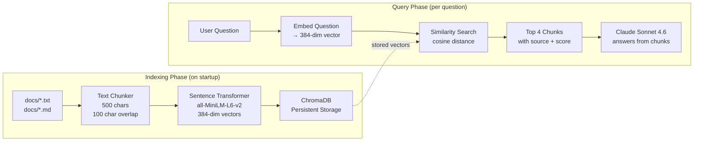
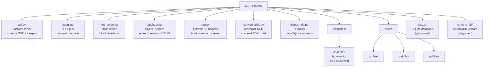
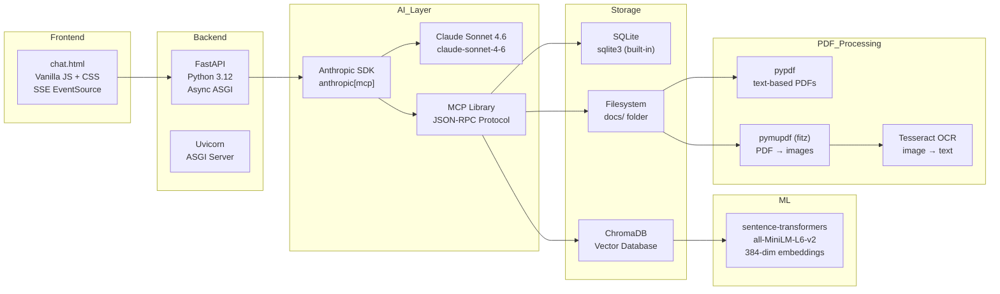

# Architecture Documentation

> This file is structured for AI-assisted diagram generation tools (Eraser.io, Lucidchart AI,
> Mermaid Live, draw.io AI, GitHub Copilot, etc.).
> Each section contains both Mermaid syntax diagrams and plain-text descriptions
> that any copilot tool can use to regenerate or modify diagrams.

---

## 1. System Overview Diagram

---

## 2. Request Lifecycle — Sequence Diagram

---

## 3. MCP Tool Architecture

---

## 4. Data Persistence Architecture

---

## 5. RAG Pipeline Diagram

---

## 6. File Structure Map

---

## 7. Technology Stack Map

---

## Component Descriptions (Plain Text for Copilot Tools)

### api.py
- Type: FastAPI web server
- Port: 8000
- Responsibilities: HTTP routing, SSE streaming, session management, MCP lifecycle
- Key endpoints: GET /, POST /chat, POST /stream, GET /tools, GET /sessions, DELETE /session/{id}
- Connections: Browser (HTTP in), Anthropic API (HTTPS out), mcp_server.py (stdio subprocess)
- On startup: spawns mcp_server.py, initialises SQLite, auto-indexes docs into ChromaDB

### mcp_server.py
- Type: MCP server (stdio transport)
- Protocol: JSON-RPC 2.0 over stdin/stdout
- Responsibilities: tool definitions, tool execution
- Tools: 8 (get_current_datetime, calculate, get_weather, manage_notes, list_docs, read_doc, index_docs, search_docs)
- Connections: api.py or agent.py (parent process via stdio), database.py, rag.py, docs/ filesystem

### database.py
- Type: SQLite abstraction layer
- File: data.db (project root, gitignored)
- Tables: notes (title PK, content, created_at), sessions (session_id PK, messages JSON, created_at, updated_at)
- Used by: mcp_server.py (manage_notes tool), api.py (session persistence)

### rag.py
- Type: RAG (Retrieval Augmented Generation) module
- Vector DB: ChromaDB (persistent, chroma_db/ folder, gitignored)
- Embedding model: sentence-transformers all-MiniLM-L6-v2 (384 dimensions, ~80MB, cached locally)
- Chunk size: 500 chars with 100 char overlap
- Collection name: "docs"
- Used by: mcp_server.py (index_docs and search_docs tools), api.py (auto-index on startup)

### agent.py
- Type: CLI application
- Interface: terminal (input/print)
- Responsibilities: same as api.py but terminal-based, single user, single session
- Used for: learning, debugging, quick testing

### chat.html
- Type: Single-page frontend
- Technology: Vanilla JavaScript, CSS
- Features: SSE streaming, session persistence via localStorage, tool call indicators
- Communication: POST /stream → SSE event stream

---

## Data Flow Descriptions (Plain Text for Copilot Tools)

### Flow 1: User asks a question (web)
1. User types in browser → POST /stream to api.py
2. api.py loads session history from SQLite
3. api.py calls Claude API with history + 8 tool schemas
4. Claude returns tool_use block for search_docs
5. api.py forwards to mcp_server.py via stdio JSON-RPC
6. mcp_server.py calls rag.py → ChromaDB similarity search
7. ChromaDB returns top 4 relevant chunks
8. api.py sends tool_result back to Claude
9. Claude streams final text response
10. api.py streams SSE events to browser
11. api.py saves updated session to SQLite

### Flow 2: Document indexing
1. api.py startup triggers index_all() in rag.py
2. rag.py reads all .txt and .md files from docs/
3. Each file is split into ~500 char chunks with 100 char overlap
4. Each chunk is embedded using all-MiniLM-L6-v2 → 384-dim float vector
5. Vectors stored in ChromaDB with metadata {source, chunk_index}

### Flow 3: PDF conversion (manual step)
1. User drops PDF into docs/ folder
2. User runs convert_pdfs.py
3. pymupdf renders each page at 300 DPI → PNG image
4. pytesseract runs Tesseract OCR on each image → text
5. Text saved as .txt alongside the original PDF
6. Server restart triggers auto-indexing of the new .txt file
